  
# Welcome, space cowboy! I'm **Luis López**

### Junior Software Developer | Tech Enthusiast | Lifelong Learner

  

---

### About Me
I'm a passionate learner and aspiring software developer with a problem oriented mindset. I love exploring new technologies and continuously improving my skills. During my career journey, I've worked on various projects that have honed my abilities in coding, debugging, and collaborating with teams. I'm excited to contribute to innovative projects and make a positive impact in the tech world.

**Currently:** Seeking for a Junior Software Developer role that allows me to grow and contribute to exciting projects.

### Tech Stack & Tools

#### Frontend

#### Backend

#### Databases

#### Tools & Extras

#### Learning & Improving

---

### GitHub Stats

---

#### Courses and Certifications

---

### Fun Section: My Code Pets!
These are my virtual code pets that kept me company while coding. They have evolved as I completed coding challenges and projects at Codedex Code Nights! 🎮

  
  
  

  <strong>Pepillo</strong> &nbsp;&nbsp;&nbsp;&nbsp;&nbsp;&nbsp;&nbsp;&nbsp;&nbsp;&nbsp;&nbsp;&nbsp;&nbsp;&nbsp;&nbsp;&nbsp;&nbsp;&nbsp;&nbsp;&nbsp;&nbsp;&nbsp;&nbsp;&nbsp;&nbsp;&nbsp;&nbsp;&nbsp;&nbsp;&nbsp;&nbsp;&nbsp;&nbsp;&nbsp;&nbsp;&nbsp; <strong>Omarcito</strong> &nbsp;&nbsp;&nbsp;&nbsp;&nbsp;&nbsp;&nbsp;&nbsp;&nbsp;&nbsp;&nbsp;&nbsp;&nbsp;&nbsp;&nbsp;&nbsp;&nbsp;&nbsp;&nbsp;&nbsp;&nbsp;&nbsp;&nbsp;&nbsp;&nbsp;&nbsp;&nbsp;&nbsp;&nbsp;&nbsp;&nbsp;&nbsp;&nbsp;&nbsp;&nbsp;&nbsp; <strong>Mamagallo</strong>

---

